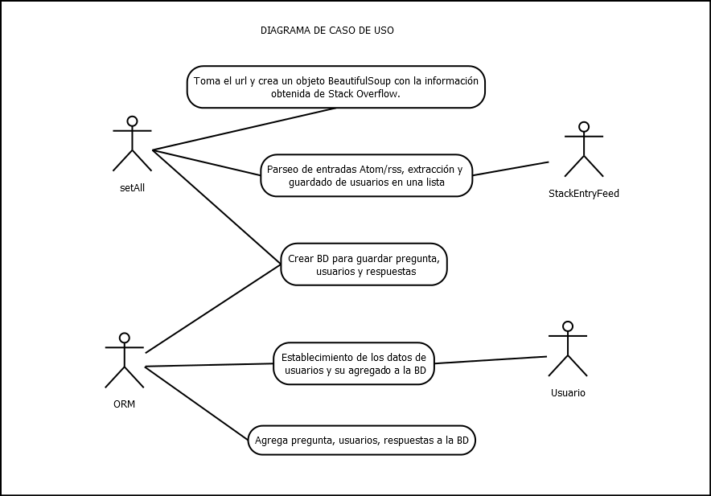
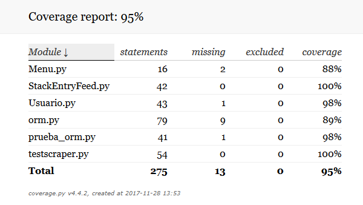

# webscraper

## Continous integration con [Travis](https://travis-ci.org/) para el proyecto de web scraping.

### Casos de uso del webscraper

### Coverage
Clic en la imagen para ver el reporte completo

